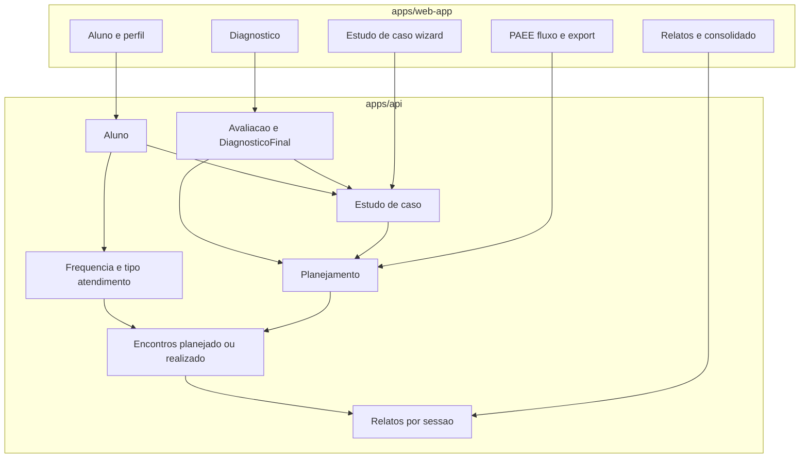

# Escopo e sprints — Plural PAEE (web-first)

**Fonte:** plano acordado na conversa do projeto (**Plural PAEE web-first**, CreatePlan).  
**Prioridade:** `apps/web-app` + `apps/api`; sem modelo generativo (“IA” = templates, regras e cópia assistida).

**Documento vivo:** o bloco *Contexto técnico confirmado* é snapshot do plano original; confira sempre `Models/`, controllers e migrations para o estado atual do repositório.

---

## Contexto técnico confirmado

- App das professoras: **`apps/web-app`** (React/Vite/Tailwind); **`apps/web`** é administrativo — só se o escopo for admin (ver `.cursor/rules/plural-monorepo.mdc`).
- Backend: **`apps/api`** (ASP.NET Core, EF Core). Domínio relevante (validar no código):
  - **`Aluno`**: evolução contínua (ex.: data de nascimento, atendimento AEE, perfil pedagógico, laudos) — ver `apps/api/Models/Aluno.cs`.
  - **`Planejamento`** (“PAEE” na UI): vínculos com alunos, habilidades, estratégias e avaliações via `AppDbContext`.
  - **`DiagnosticoFinal`**: migração planejada away from percentual como verdade principal → níveis discretos (**atingiu / parcialmente / não**).
- Web já usa **`docx`** no cliente para export (ex.: `apps/web-app/src/pages/aluno/AlunoProfilePage.tsx`) — alinhar export PAEE a esse padrão quando aplicável.
- **Estudo de caso (Fase 3 — núcleo fechado):** modelo + **11 eixos** no catálogo (seed); **todos os eixos obrigatórios** no wizard e na edição; wizard `/estudo-caso/nova`, perfil do aluno (lista, detalhe, edição, exclusão); texto simulado com cabeçalho (instituição, professor, DN, ano/série; **logo** da escola = melhoria futura — sem campo URL em `Escola`); inclusão do **diagnóstico final mais recente** do aluno quando existir; export **PDF** (`jspdf`), **Word** no cliente (`docx`) e **`GET api/EstudoDeCaso/{id}/export-texto`**. **Relatos** (`RelatoAtendimento` ou equivalente) permanecem na **Fase 5**.

## Princípios do ciclo (fixos)

- **“IA”:** apenas templates, concatenação de texto, listas de sugestões e UX opcional de “processamento”; sem modelo generativo.
- **Estudo de caso:** estrutura alinhada ao material da cliente; **defaults** versionáveis (seed/JSON) até template oficial da empresa.
- **Fora deste escopo (neste plano):** modelo “teste por aluno”; app mobile em paralelo até API estável; histórico entre professoras; perfil coordenação/família.

---

## Fase 1 — Cadastro e atendimento

**API**

- Migração em `alunos`: `DataNascimento` (obrigatória conforme negócio); campos de **atendimento:** frequência (vezes/semana), dias da semana (normalizar: JSON ou tabela filha), duração (minutos), tipo (`Individual` | `Grupo` | `Colaborativo` | `Itinerante`).
- **Perfil pedagógico:** evoluir ou complementar laudo/nova tabela para **potencialidades** e **necessidades** (texto + opcional seleção); manter compatibilidade com laudos existentes (migração de dados ou convivência temporária).
- DTOs + `AlunoService` + endpoints já usados pelo web-app.

**Web-app**

- Atualizar `AlunoFormDialog.tsx`, tipos em `types/aluno.ts` e `alunoService.ts`: DN, bloco atendimento, substituir ênfase “laudo” por “perfil pedagógico” na UX.
- `AlunoProfilePage.tsx`: exibir novos campos e preparar dados para futuros exports.

**Critérios de aceite:** criar/editar aluno com DN + agenda AEE (DN validada também na API: obrigatória, faixa plausível e não futura); dados persistidos e retornados na API usada pela lista/perfil.

---

## Fase 2 — Diagnóstico: três níveis e sugestões para PAEE

**API**

- Substituir `PercentualAutonomia` por modelo estável (ex.: enum `NivelDesempenho` + coleção por habilidade/atividade ou colunas equivalentes); migration com regra para dados antigos (ex.: mapear percentuais para parcial/não ou null + regeneração).
- Endpoints de diagnóstico final + geração de resumo/recomendações ajustados; endpoint ou campo de **sugestão** de habilidades/objetivos para PAEE (regra sobre itens “não atingidos” / parciais).

**Web-app**

- Tipos `avaliacao-diagnostica.ts` e fluxos de desempenho/preview: remover UI de percentual como verdade principal; exibir três níveis; PDF diagnóstico: manter foco em layout (imagens).

**Critérios de aceite:** novo diagnóstico só persiste níveis discretos; relatório/PDF consistente; sugestões aparecem na UI; **percentual numérico não é destaque na tela de lançamento de desempenho** (níveis discretos e perfil agregado são a mensagem principal).

---

## Fase 3 — Estudo de caso (11 eixos + texto simulado)

**API**

- Novas tabelas (ex.: `EstudoDeCaso`, eixos como JSON estruturado ou tabelas normalizadas por eixo — decisão na implementação entre flexibilidade vs consulta).
- Endpoint: salvar rascunho, gerar texto (serviço **sintético** no servidor ou montagem no cliente a partir de payload + defaults); endpoint de export (HTML/PDF ou preparar conteúdo para docx).
- Seed de opções default alinhadas ao PDF cliente.

**Web-app**

- Nova rota (ex.: `/alunos/:id/estudo-de-caso` ou wizard dedicado), formulário multi-step, pré-visualização “gerado pela plataforma”, loading simulado opcional.

**Critérios de aceite:** catálogo com todos os eixos versionados em seed; **todos os eixos obrigatórios** no formulário (marcação de cada um); texto gerado deterministicamente a partir das seleções + diagnóstico recente; cabeçalho (nome professora, DN, instituição); logo da escola quando houver campo no cadastro; export **PDF**, **Word (.docx)** e texto pela API.

---

## Fase 4 — PAEE: fluxo cliente, encontros, export Word

**API**

- Estender `Planejamento` ou tabelas relacionadas: objetivos **curto/médio/longo** (preferência seleção de catálogo + texto); **encontros** com data, `Planejado` e `Realizado`, vínculo opcional a habilidade foco / estratégia / recurso / atividade sugerida; geração de datas sugeridas a partir da frequência do aluno (serviço puro).
- Validações: um PAEE por período com blocos combinados (alinhado à cliente); vários alunos já existem via `AlunosXPlanejamento` — garantir UX/API para grupo.
- Endpoint para **montar documento PAEE** (HTML/estrutura) consumido pelo cliente **docx** ou gerar `.docx` no servidor (decidir uma vez; web-app já usa `docx` no perfil).

**Web-app**

- Evoluir `PlanejamentoDetailPage.tsx` (ou quebrar em subcomponentes): steps ou seções para habilidades → objetivos → estratégias → grade de encontros → avaliações → revisão; botão export Word; campo/checklist para **assinatura** (metadado, não integração ICP-Brasil neste ciclo).

**Critérios de aceite:** professora preenche planejado e realizado por data; export Word editável; vínculo N alunos funcional.

---

## Fase 5 — Relatos de atendimento

**API**

- Entidades `RelatoAtendimento` (ou nome alinhado ao domínio): aluno, PAEE opcional obrigatório para validação “consonância”, data sessão, presença/ausência, tipo ocorrência (normal/cancelada/reagendada), habilidade e estratégia referenciadas ao plano, texto observações, listas de avanços/dificuldades.
- Geração automática de **slots** (cron ou on-demand ao abrir mês) baseada em dias da semana do cadastro.
- Endpoint relatório consolidado com `dataInicio`/`dataFim` escolhidos pela professora.

**Web-app**

- Nova área (ex.: `/relatos` substituindo redirect atual em `routes/index.tsx`) ou integração ao perfil do aluno; lista por sessão; filtros e export consolidado.

**Critérios de aceite:** não registrar relato sem presença/outcome; habilidades fora do PAEE bloqueadas ou avisadas conforme regra escolhida.

---

## Fase 6 — Sugestões (“IA simulada”) transversal

- Serviço único (API ou pacote compartilhado) que, dado contexto (habilidade + etapa), retorna **N sugestões de atividade** (tabela seed).
- Acionar após seleção de habilidade no PAEE e onde o PDF cliente pedir.

---

## Paralelo — Hotmart e LGPD

- **Hotmart:** código já existe (`WebhooksController.cs`, `HotmartWebhookService.cs`). Checklist operacional: URL, `Hottok`, `ProductId`, e-mail que não falhe o `Registro` (rollback em `AutenticacaoService`); revisar senha fixa e template com credenciais.
- **LGPD/retenção:** spike jurídico/produto **antes** de implementar expurgo ou grace period; até lá, apenas documentar risco e não codificar política agressiva.

---

## Testes e qualidade

- Por fase: migrations revisadas; `dotnet test` / build API onde houver testes; `npm run test:run -w @plural/web-app` nos fluxos alterados (formulários, services).

---

## Ordem de PRs sugerida

1. Fase 1 (cadastro)  
2. Fase 2 (diagnóstico) — breaking na API do diagnóstico final coordenado com front  
3. Fase 3 (estudo de caso)  
4. Fase 4 (PAEE)  
5. Fase 5 (relatos) + ajuste de rota `/relatorios`  
6. Fase 6 (sugestões seed) + hardening Hotmart

---

## Materiais da cliente (referência)

Arquivos em `docs/cliente/` e questionário em `docs/` (PDFs), por exemplo: PAEE Plural, Novo cadastro, Estudo de caso, Perguntas para alinhamento pedagógico e de produto.
